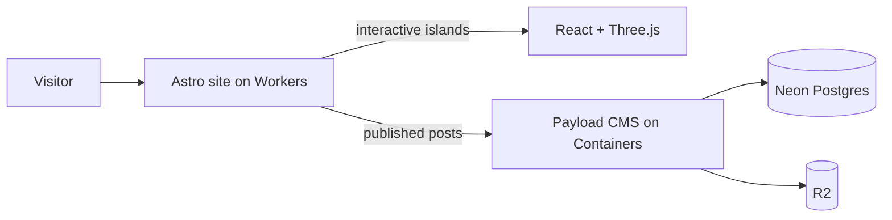

# Templ3 Personal Site Plan

## Recommended Direction

- Usar `Astro` como base del sitio y `React` solo en islas interactivas. Esto encaja mejor que una SPA pura para una web personal con blog, SEO y rendimiento en `Cloudflare Workers`.
- Reservar `Three.js` para una experiencia 3D equilibrada: una escena principal interactiva y algunos acentos visuales, no toda la navegación en 3D.
- Desplegar el frontend en `Cloudflare Workers` con el adaptador de `Astro`.
- Ejecutar `Payload CMS` en `Cloudflare Containers` para mantener una experiencia editorial completa sin forzar el CMS al runtime de `Workers` puro.
- Usar `Neon` como `Postgres` desde el día 1 para dejar una migración futura a `VPS` u `homelab` mucho más sencilla que si empezaras con `D1`.

## Recommended Stack

- Frontend: `Astro` + `TypeScript`
- Interactividad: `React`
- 3D: `three`, `@react-three/fiber`, `@react-three/drei`
- Estilo/UI: `Tailwind CSS` o CSS modular con tokens de tema; tipografías monoespaciadas/retro para la capa "terminal"
- Animación 2D: `Framer Motion` solo donde aporte
- Sitio público: `Cloudflare Workers`
- Blog CMS: `Payload CMS` en `Cloudflare Containers`
- Base de datos: `Neon Postgres`
- Media: `Cloudflare R2`
- Red y edge: DNS, CDN, WAF y dominio gestionados por `Cloudflare`

## Why This Architecture

- `Astro` te da páginas rápidas, indexables y con muy poco JavaScript por defecto.
- Las islas React permiten cargar el 3D solo en el hero o secciones concretas.
- `Payload` resuelve tu requisito principal del blog: panel admin accesible desde cualquier sitio, editor rico, media, embeds y bloques de código sin que tengas que desarrollar la UI.
- `Cloudflare Containers` deja al CMS correr en un entorno más natural que `Workers` puros, reduciendo fricción técnica.
- `Neon` encaja bien con `Payload`, probablemente cubre tu volumen en free tier y además evita atarte a `D1`.
- Para un blog personal, el coste esperado debería rondar los `5-8 USD/mes` al inicio, con el plan de pago de `Workers` como componente principal.

## Information Architecture

- `Home`: manifiesto visual de `Templ3`, logo, claim y entrada a las secciones.
- `About`: quién eres, enfoque `DevSecOps -> Red Team / Pentest / Bughunting`, stack y filosofía.
- `Projects` o `Arsenal`: proyectos, labs, writeups destacados, tooling, hardware y experimentos.
- `Blog`: artículos técnicos y personales.
- `Links`: GitHub, LinkedIn, X/Mastodon, email, Hack The Box, TryHackMe, etc.
- `Now` opcional: qué estás estudiando, construyendo o rompiendo ahora.

## Visual Direction

- Concepto: "altar/terminal soviética reinterpretada como reliquia cyberpunk".
- Mezcla tonal: agresivo-tech + cute/kawaii + decadencia postapocalíptica.
- Paleta inicial: negro, grafito, magenta/neón del logo, verde CRT puntual, gris metal envejecido.
- Recursos visuales:
  - marcos de terminal, scanlines suaves, ruido CRT muy contenido
  - iconografía de hardware, señales, warning labels, pegatinas/glifos cute
  - microcopy tipo sistema/ritual/daemon, sin volver la UX críptica
- Evitar que la estética gane a la lectura: el blog y la carta de presentación deben seguir siendo muy claros.

## 3D Scope

- Escena principal recomendada: un escritorio/terminal retro-futurista o una "máquina santuario" con hotspots.
- Interacciones posibles:
  - encender la terminal para revelar tu bio
  - cartuchos/disquetes/cables para ir a proyectos, blog y redes
  - pequeñas animaciones de ventiladores, LEDs, osciloscopio o overlays holográficos
- Reglas de rendimiento:
  - cargar la escena solo en portada
  - fallback estático si `prefers-reduced-motion` o dispositivo débil
  - mantener geometría y texturas ligeras

## Blog Strategy

- Recomendación principal: `Payload CMS` en `cms.sigterm.vodka`, desplegado en `Cloudflare Containers`.
- Modelo:
  - colección `posts`
  - colección `projects`
  - colección `links`
  - colección `tags`
  - colección `media`
  - borradores, fecha de publicación, excerpt, cover, contenido rico, embeds, SEO básico
- Public site:
  - el frontend consulta los posts publicados por API
  - las páginas de artículo se renderizan con `Astro` para mantener SEO y velocidad
- Persistencia y media:
  - `Neon Postgres` como base de datos principal
  - `R2` para imágenes, covers y media
  - `Hyperdrive` opcional más adelante si necesitas optimizar conexiones desde Cloudflare a `Postgres`
- Estrategia de salida:
  - si más adelante el coste o el encaje de `Containers` deja de compensar, `Payload` puede migrarse a `VPS` u `homelab`
  - mantener `Postgres` fuera de `Cloudflare` hace esa migración mucho más limpia

## Suggested Repository Shape

- `[apps/site](apps/site)`: sitio público con `Astro`
- `[apps/cms](apps/cms)`: `Payload CMS` para desplegar en `Cloudflare Containers`
- `[packages/ui](packages/ui)` opcional: componentes compartidos y tokens de diseño
- Archivos clave iniciales:
  - `[apps/site/src/pages/index.astro](apps/site/src/pages/index.astro)`
  - `[apps/site/src/components/scene/TempleScene.tsx](apps/site/src/components/scene/TempleScene.tsx)`
  - `[apps/site/src/pages/blog/[slug].astro](apps/site/src/pages/blog/[slug].astro)`
  - `[apps/site/wrangler.jsonc](apps/site/wrangler.jsonc)`
  - `[apps/cms/payload.config.ts](apps/cms/payload.config.ts)`
  - `[apps/cms/wrangler.jsonc](apps/cms/wrangler.jsonc)`
  - `[apps/cms/Dockerfile](apps/cms/Dockerfile)`

## Delivery Phases

1. Diseñar identidad visual, sitemap y narrativa de marca para `Templ3`.
2. Levantar el sitio público con `Astro`, layout, routing y diseño base.
3. Implementar la escena 3D de portada y degradación elegante a modo estático.
4. Integrar el blog con `Payload`, modelado de contenido, `Neon` y `R2`.
5. Conectar dominio, despliegue en `Containers`, observabilidad y optimización de rendimiento.

## Architecture Sketch

## Decision Notes

- Mi recomendación final es `Astro + React islands + Payload` con `Cloudflare Workers` para el sitio, `Cloudflare Containers` para el CMS, `Neon` como `Postgres` y `R2` para media.
- Solo elegiría `React SPA` pura si quisieras una experiencia mucho más app-like que editorial.
- Solo elegiría un CMS Git-based como primera opción si priorizaras simplicidad operativa por encima de una experiencia editorial rica.
- Evito `D1` en esta fase para que la arquitectura sea más portable y la salida a self-hosted requiera menos esfuerzo si en el futuro cambias de idea.

