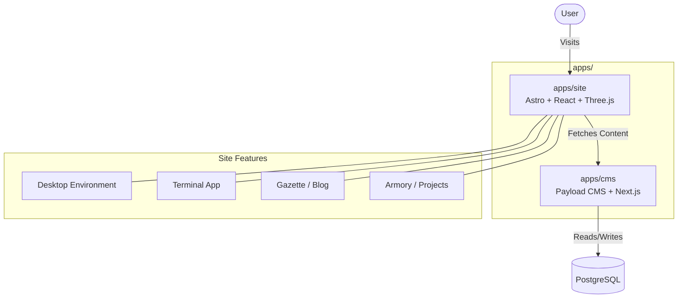

# Templ3

Templ3 is a personal website and portfolio structured as a monorepo. It features a retro cyberpunk aesthetic, simulating a desktop operating system (Templ3 OS) with a functional terminal, window management, and various applications. The project is divided into a frontend built with Astro and React, and a headless CMS built with Payload.

## Architecture

The repository is managed as a `pnpm` workspace containing two main applications:



## Project Structure

- `apps/site`: The frontend application.
  - Built with **Astro** for routing and static generation.
  - Uses **React** for complex interactive UI components (window manager, taskbar, applications).
  - Uses **Three.js** (`@react-three/fiber`, `@react-three/drei`) for visual effects (CRT overlays, terminal rendering).
  - Deploys to Cloudflare Pages/Workers.
- `apps/cms`: The backend content management system.
  - Built with **Payload CMS 3.0** and **Next.js**.
  - Uses PostgreSQL as the database.
  - Manages data for blog posts, projects, and social links.
- `packages/`: Directory reserved for shared libraries or configuration (currently empty).

## Development

### Prerequisites

- Node.js (v18.20.2+ or v20.9.0+)
- pnpm (v9 or v10)

### Setup

1. Install dependencies from the root:
   ```bash
   pnpm install
   ```
2. Start the development servers:
   ```bash
   # Run both apps concurrently
   pnpm dev
   ```
   Or run them individually by navigating to their respective directories.

### CMS Configuration

Ensure you have a PostgreSQL database available and the corresponding environment variables set in `apps/cms/.env`. Refer to the Payload documentation for more details on environment configuration.